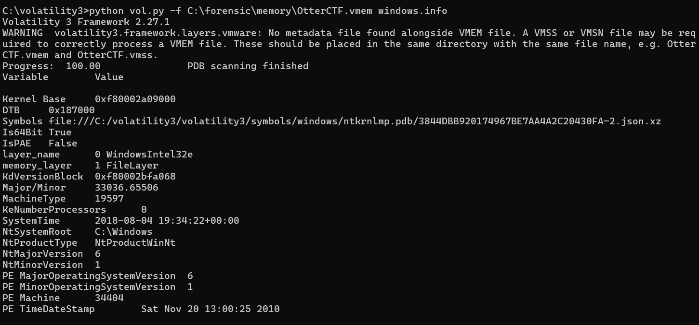
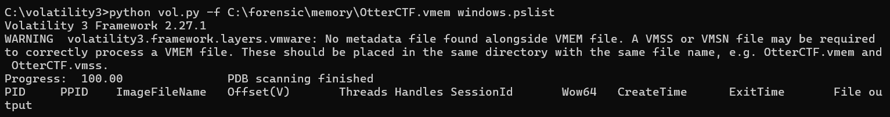

# memory_forensics_basics
Volatility 3를 사용한 Windows 메모리 포렌식 분석

---

## 1. 프로젝트 개요
본 프로젝트는 Volatility3 프레임워크를 활용하여 
Windows 메모리 덤프 파일을 분석하고, 
덤프 유형에 따른 분석 가능 범위와 한계를 이해하는 것을 목적을 한다. 

- 분석 대상: Windows 7 SP1 x64 메모리 덤프 (OtterCTF, VMEM)
- 분석 도구: Volatility3
- 분석 목적: 메모리 덤프의 운영체제 정보 확인 및 프로세스 분석 가능 여부 검증

---

## 2. 분석 환경

- Host OS: Windows
- Python: 3.10
- Volatility Framework: 2.27.1
- Memory Dump Type: VMware VMEM

---

## 3. OS 정보 확인(window.info)

Volatility3의 'windows.info' 플러그인을 사용하여 
메모리 덤프에 포함된 운영체제 정보를 식별하였다. 

분석결과, 대상 시스템은 
**Windows 7 SP1 x64 환경**임을 확인할 수 있었다.

---

## 4. 프로세스 분석 시도(windows.pslist)

'windows.pslist' 플러그인을 사용하여 
메모리 상 실행 중인 프로세스 목록을 확인하고자 하였으나, 
출력 결과가 제한됨을 확인하였다.

## 원인 분석

분석 대상 파일은 **VMware 기반 VMEM 메모리 덤프**로,
일반적으로 다음과 같은 메타데이터 파일이 함께 필요하다.

- '.vmss' 또는 '.vmsn'

본 덤프에는 해당 메타데이터 파일이 제공되지 않아
Volatility는 커널 정보는 식별하였으나
프로세스 구조 복원에는 실패하였다.

이로 인해 'pslist' 실행 시 컬럼 헤더만 출력되고
실제 프로세스 정보는 확인되지 않았다. 

이는 **가상화 환경 메모리 덤프 분석 시 발생할 수 있는 대표적인 제약 사항** 이다. 

---

## 5. 결론 및 배운 점 

- 메모리 덤프 유형에 따라 분석 가능 범위가 달라질 수 있음을 이해하였다.
- VMEM 덤프는 메타데이터 파일 유무가 분석 결과에 큰 영향을 미친다.
- 단순 도구 실행이 아닌, 결과의 원인을 해결하는 것이 포렌식 분석에서 중요함을 학습하였다.
